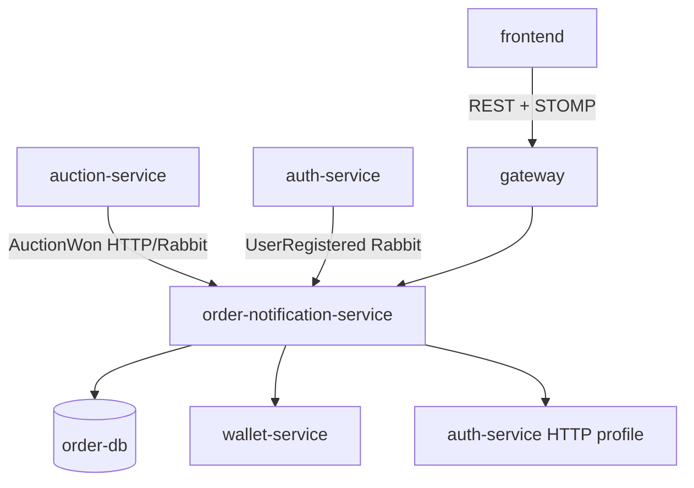

# Software Architecture

## Integrations

| Integration | Purpose |
|-------------|---------|
| Auction | Auto-create order on win (`AuctionWonEventRequest`) |
| Wallet | Refund on dispute buyer win (`WalletClient`) |
| Auth | User email for notifications; `AuthEventConsumer` |
| RabbitMQ | `BIDMART_EVENTS_EXCHANGE` |
| Frontend STOMP | `/ws/notifications` through gateway sticky WS |

## Notification channels

1. **Persistence** — `BidmartNotification` entity, REST list/mark-read.
2. **Email** — `SmtpNotificationEmailSender` (SMTP env from compose).
3. **Web Push** — VAPID keys `BIDMART_PUSH_VAPID_*`.
4. **STOMP** — public auction topics + private user queues ([11. Keamanan stomp.md](./11. Keamanan stomp.md)).

## Realtime architecture

- `AuctionRealtimeService` publishes to `/topic/auctions/{id}`, `/topic/listings/{listingId}`.
- `NotificationService` publishes to `/topic/notifications/users/{userId}` with authorization checks.

## Observability

- `/actuator/prometheus` scraped as `bidmart-order-service` in Prometheus config.
