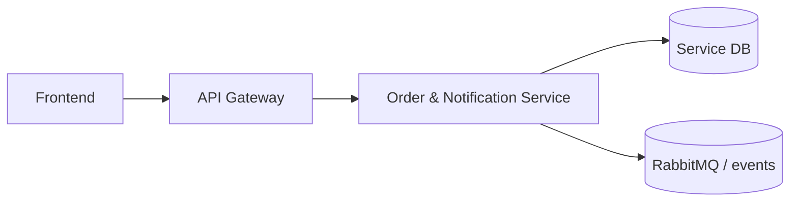

# Software Architecture

## Responsibility

Order creation from auction events, shipping lifecycle, buyer confirmation, dispute opening/resolution, seller escrow payout path, notification persistence, websocket, email, and push dispatch.

## Integration Surface

`/api/v1/orders/**`, dispute endpoints, diagnostics, `/api/v1/notifications/**`, websocket notification destinations.

## Platform Position

## State and Consistency

Orders, preferences, subscriptions, and notifications are persisted in PostgreSQL. Wallet side effects are called through `WalletClient` and notification dispatch is async/failure-isolated.

## Cross-Service Contract

The gateway and event bus are the only supported cross-service entry points. Downstream consumers must tolerate additive optional fields, while existing required fields and routing keys remain stable.
